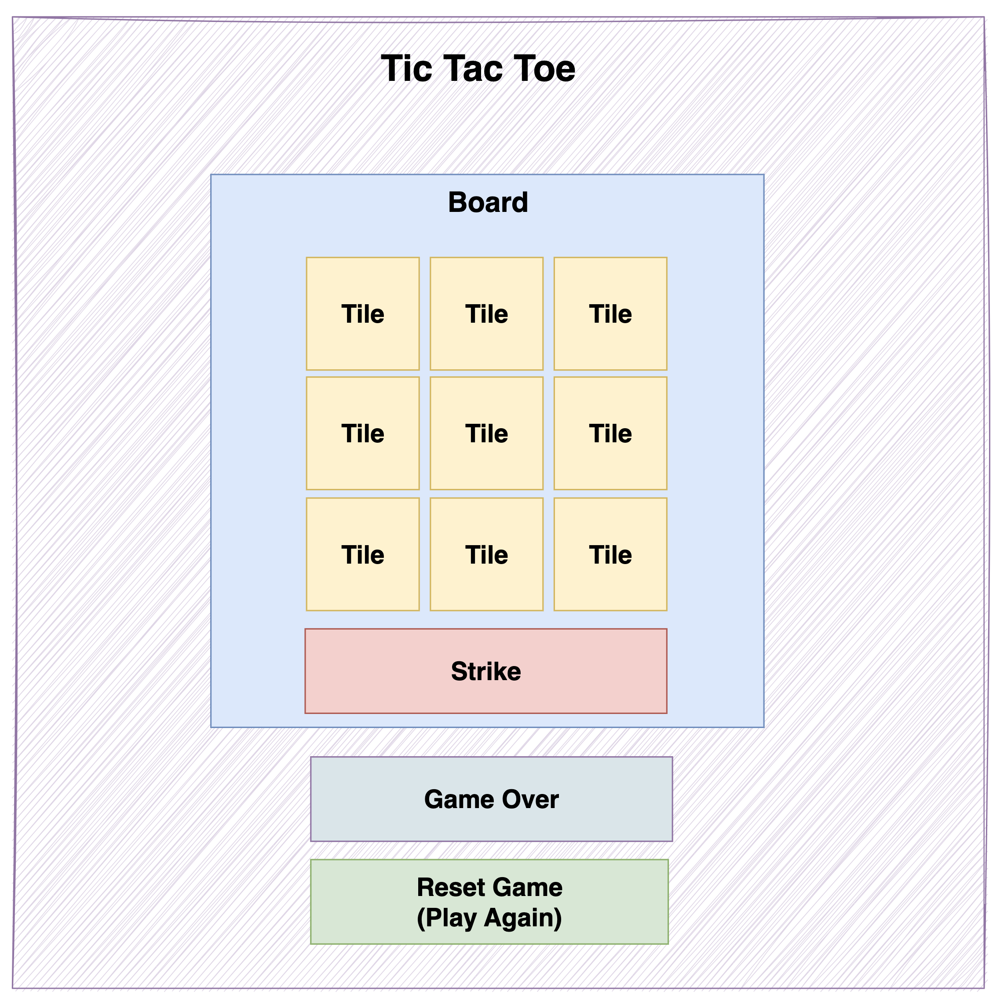

# Tic Tac Toe With React

### Try the game here:

https://tushar20-20mahajan.github.io/tic_tac_toe/

Learn React concepts such as thinking in components, useState hook, useEffect hook, prop drilling. We also cover JS audio, CSS concepts such as flex-box and grid for display and more to create a delightful UI.

The following component diagram is used to help us think in components.

